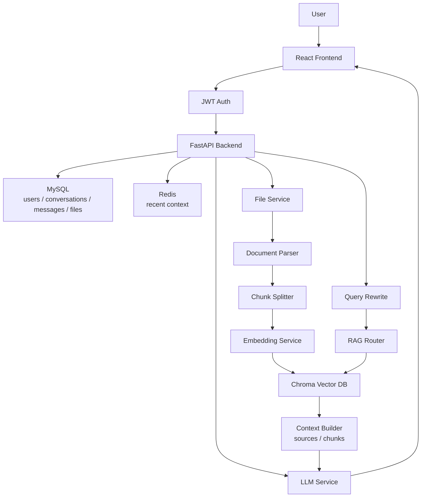
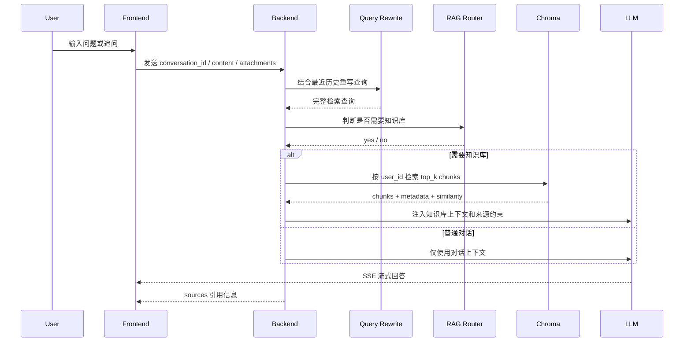

# AI Chat Knowledge Base

一个面向个人知识库场景的 AI 聊天系统，支持用户登录、多会话管理、流式回答、Redis 上下文缓存、MySQL 历史持久化、长期摘要记忆，以及基于文件上传的 RAG 检索增强问答。

## 项目亮点

- 用户系统：注册、登录、JWT 鉴权、用户级会话权限校验。
- 多会话聊天：支持新建会话、历史会话、消息持久化和流式输出。
- 上下文记忆：Redis 保存短期上下文，MySQL 保存全量历史，Summary Memory 压缩长期对话。
- 知识库 RAG：文件上传、文本解析、chunk 切分、embedding、Chroma 向量检索。
- 用户隔离：向量 metadata 写入 `user_id`，检索时按用户过滤，避免跨用户读取知识库。
- 智能检索流程：Query Rewrite 处理多轮追问，RAG Router 判断是否启用知识库，相似度阈值过滤低相关内容。
- 知识库管理：前端支持查看已上传文件、索引状态、重新索引和删除文件。
- 来源引用：回答可展示来源文件、chunk 和相似度信息，便于追溯回答依据。

## 技术栈

后端：

- FastAPI
- SQLAlchemy
- MySQL
- Redis
- Chroma
- LangChain OpenAI
- DeepSeek/OpenAI compatible API

前端：

- React
- TypeScript
- Vite
- Ant Design
- CSS Modules

## 架构图



## RAG 工作流



## 目录结构

```text
backend/
  app/
    api/          FastAPI 路由
    crud/         数据库读写
    database/     MySQL / Chroma 配置与模型
    services/     聊天、RAG、文件、Embedding 等业务逻辑
frontEnd/
  web-chat/
    src/
      api/        前端接口定义
      components/ 聊天、侧边栏、知识库管理组件
      pages/      页面入口
      types/      TypeScript 类型
```

## 核心接口

- `POST /api/auth/register`：注册
- `POST /api/auth/login`：登录
- `GET /api/conversation`：获取会话列表
- `POST /api/conversation`：创建会话
- `GET /api/conversation/{id}/messages`：获取会话消息
- `POST /api/chat`：流式聊天
- `POST /api/file/upload`：上传知识库文件
- `GET /api/file`：获取知识库文件列表
- `POST /api/file/{file_id}/reindex`：重新索引文件
- `DELETE /api/file/{file_id}`：删除文件和对应向量

## 本地运行

后端：

```bash
cd backend
pip install -r requirements.txt
uvicorn app.main:app --reload --host 0.0.0.0 --port 8000
```

前端：

```bash
cd frontEnd/web-chat
npm install
npm run dev
```

## 简历描述参考

基于 FastAPI + React 实现个人知识库 AI 聊天系统，支持用户注册登录、多会话管理、流式对话、Redis 上下文缓存、MySQL 历史持久化、Summary Memory 长期记忆、文件上传解析、Embedding 向量化存储与基于 Chroma 的 RAG 检索增强问答。设计并实现 Query Rewrite + RAG Router 流程，解决多轮追问下知识库检索不稳定的问题，并通过 `user_id` metadata 实现用户级知识库隔离。
